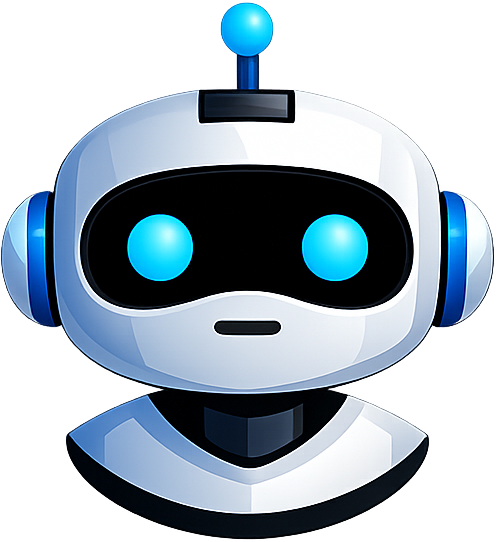

# 🤖 Offline AI Assistant

<p align="center">
  
</p>

<p align="center">
  
  
  
  
</p>

<p align="center">
  <b>A privacy-first Android AI assistant that runs entirely on-device using GGUF language models powered by llama.cpp.</b><br/>
  No cloud • No subscriptions • No tracking • Fully Offline
</p>

<p align="center">
  
  
  
  
  
  
</p>

---

# 📱 Overview

**Offline AI Assistant** is a modern Android application that brings powerful AI directly to your device.

Unlike cloud-based AI assistants, every conversation runs locally using **GGUF language models** powered by **llama.cpp**, ensuring your chats remain private and accessible even without an internet connection.

Once a model is downloaded, all AI inference happens completely on-device.

Designed with a privacy-first approach, the app provides a smooth and modern chat experience while supporting multiple open-source language models.

---

# ✨ Features

- 🧠 Fully offline AI conversations
- 📥 Download and manage GGUF language models
- 🔄 Switch AI models without restarting the app
- 💬 Session-based chat history
- 📂 Conversation grouping (Today, Yesterday, This Week, Older)
- 🕵️ Private Chat mode (chat never stored)
- ✍️ Writing & rewriting assistant
- 📄 Resume & Email writing assistant
- 📚 Text summarization
- 🌍 Language translation
- 💻 Programming assistance
- 🎙️ Voice-to-text input
- 🔊 Text-to-speech playback
- ⏹️ Stop AI response generation
- 📋 Copy AI responses
- 📤 Share messages and conversations
- 📥 Export conversations
- 🌗 Light / Dark / System theme
- 🔒 No tracking
- 🔒 No cloud backend

---

# 🤖 Supported Models

The application currently supports the following GGUF models:

| Model | Quantization | Download Size | Recommended RAM |
|--------|--------------|---------------|-----------------|
| SmolLM2 360M | Q4_K_M | **258 MB** | 2 GB+ |
| Qwen 2.5 Mini (0.5B) | Q4_K_M | **468 MB** | 3 GB+ |
| TinyLlama 1.1B | Q4_K_M | **637 MB** | 4 GB+ |
| Gemma 3 1B ⭐ Recommended | Q4_K_M | **768 MB** | 6 GB+ |
| Gemma 3 Advanced (4B) | Q4_K_M | **2.37 GB** | 8 GB+ |

---

# 🛠 Tech Stack

| Technology | Purpose |
|------------|----------|
| Kotlin | Programming Language |
| Jetpack Compose | Declarative UI Toolkit |
| Material 3 | Design System |
| MVVM | Presentation Architecture |
| Clean Architecture | Project Structure |
| Hilt | Dependency Injection |
| Room | Chat history & session persistence |
| DataStore | Theme, onboarding & selected model preferences |
| Navigation Compose | Navigation |
| Kotlin Coroutines | Background operations |
| Kotlin Flow | Reactive UI state |
| OkHttp | GGUF model downloading |
| llama.cpp | Local LLM inference engine |
| JNI / C++ | Native AI integration |
| Android SpeechRecognizer | Voice input |
| Android TextToSpeech | Voice output |

---

# 🧠 Architecture

```text
Presentation Layer
├── Compose UI
├── ViewModels
└── UiState

        ↓

Domain Layer
├── Use Cases
├── Repository Interfaces
└── Business Logic

        ↓

Data Layer
├── Repository Implementations
├── Room Database
├── DataStore
├── Download Manager
└── Local AI Data Source

        ↓

AI Layer
├── ModelSessionManager
├── ModelManager
├── LlmEngine
└── llama.cpp (JNI)
```

---

# 📂 Project Structure

```text
offline-ai-assistant
│
├── ai
│   ├── engine
│   ├── gguf
│   │   └── internal
│   │
│   ├── manager
│   └── model
│
├── data
│   ├── download
│   ├── llm
│   ├── local
│   │   ├── dao
│   │   ├── database
│   │   ├── datasource
│   │   ├── entity
│   │   └── preferences
│   │
│   ├── mapper
│   ├── model
│   └── repository
│
├── di
├── domain
│   ├── model
│   ├── repository
│   └── usecase
│
├── ui
│   ├── common
│   ├── features
│   │   ├── about
│   │   ├── chat
│   │   ├── model_selection
│   │   ├── settings
│   │   └── welcome
│   │
│   ├── navigation
│   └── theme
│
├── utils
│
├── BaseApp.kt
└── MainActivity.kt
```

---

# 📦 Package Overview

| Package | Responsibility |
|----------|----------------|
| **ai** | Local LLM inference, JNI bridge, GGUF support, model loading & generation |
| **data** | Repository implementations, Room database, DataStore, downloads |
| **domain** | Business logic, repository contracts and use cases |
| **ui** | Jetpack Compose screens, ViewModels, navigation and theming |
| **di** | Dependency injection using Hilt |
| **utils** | Helper classes including RAM checks, exporters and download utilities |

---

# 🏗️ Architecture Principles

This project follows modern Android development best practices.

### MVVM

Each screen is backed by its own ViewModel exposing immutable UI state through **StateFlow**.

### Clean Architecture

Responsibilities are separated into Presentation, Domain and Data layers, making the project easier to maintain and extend.

### Repository Pattern

Repositories act as the single source of truth while hiding implementation details from the presentation layer.

### Dependency Injection

Hilt is used to provide dependencies throughout the application.

### Reactive UI

The UI is completely reactive using:

- StateFlow
- Coroutines
- Jetpack Compose

### Offline-First

After downloading a model, all AI inference happens locally without requiring internet access.

### Native AI Integration

The application integrates **llama.cpp** through JNI to perform efficient on-device inference using GGUF models.

---

# 🔄 AI Model Lifecycle

```text
User selects a model
        │
        ▼
Check available RAM
        │
        ▼
Download GGUF model
        │
        ▼
Load model through JNI
        │
        ▼
ModelManager initializes llama.cpp
        │
        ▼
Model ready
        │
        ▼
Start chatting
```

---

# ⚙️ How AI Works

```text
User Prompt
      │
      ▼
ChatViewModel
      │
      ▼
Chat Use Case
      │
      ▼
Repository
      │
      ▼
ModelSessionManager
      │
      ▼
ModelManager
      │
      ▼
LlamaCppEngine
      │
      ▼
JNI Bridge
      │
      ▼
llama.cpp
      │
      ▼
GGUF Model
      │
      ▼
AI Response
```

---

# 🚀 Why This Project?

Offline AI Assistant demonstrates how to build a production-quality Android application around modern on-device AI technologies.

It showcases:

- Modern Android app architecture
- Native C++ integration through JNI
- Local LLM inference with llama.cpp
- GGUF model management
- Room database persistence
- DataStore preferences
- Dependency Injection with Hilt
- Reactive UI using StateFlow
- Offline-first application design
- Material 3 UI with Jetpack Compose

---

# 📸 Screenshots

<p align="center">
  
  
  
</p>

> *More screenshots will be added as the project evolves.*

---

# 🎥 Demo

A demo video will be added soon.

> You can also build and run the project locally to experience the app.

---

# 🚀 Getting Started

## Prerequisites

Before building the project, install:

- Android Studio Narwhal or newer
- Android SDK
- Android NDK
- CMake
- JDK 17+

---

## Clone the Repository

```bash
git clone https://github.com/its-hazratbilal/offline-ai-assistant.git
```

Open the project in Android Studio.

---

## Native Build Requirements

This project compiles **llama.cpp** from source using the Android NDK.

Ensure the following SDK components are installed:

- Android NDK
- CMake

The first build may take a few minutes while the native library is compiled.

---

## Build & Run

Simply run the **app** module on an Android device.

A physical device is recommended for the best AI performance.

Minimum SDK: **30**

Target SDK: **37**

After launching the app:

1. Select an AI model.
2. Download the model.
3. Wait for the model to finish loading.
4. Start chatting completely offline.

---

# 📦 Download

Prebuilt APKs are available from the GitHub Releases page.

👉 **Releases**

https://github.com/its-hazratbilal/offline-ai-assistant/releases

---

# 🧪 Tested On

The application has been tested on Android devices running Android 11 and above.

Performance depends on:

- Device RAM
- CPU performance
- Selected GGUF model size

Larger models provide better responses but require more memory.

---

# 🤝 Contributing

Contributions are always welcome!

If you'd like to improve the project:

1. Fork the repository
2. Create a feature branch

```bash
git checkout -b feature/my-feature
```

3. Commit your changes

```bash
git commit -m "Add amazing feature"
```

4. Push the branch

```bash
git push origin feature/my-feature
```

5. Open a Pull Request

---

# 🛣️ Roadmap

Planned features include:

- [ ] Code syntax highlighting
- [ ] Chat search
- [ ] Chat pinning
- [ ] Image understanding (vision models)
- [ ] Document summarization
- [ ] RAG (Retrieval-Augmented Generation)
- [ ] Function calling
- [ ] Better GPU acceleration
- [ ] More GGUF model support
- [ ] Streaming response improvements
- [ ] Tablet UI optimization
- [ ] Compose Multiplatform support

---

# 🎯 What This Project Demonstrates

Offline AI Assistant showcases a production-style Android application built around modern on-device AI technologies.

This project demonstrates:

- 🤖 On-device LLM inference using **llama.cpp**
- 📦 Integration of native C++ libraries through **JNI**
- 🏗️ MVVM with **Clean Architecture**
- 💉 Dependency Injection using **Hilt**
- ⚡ Reactive UI with **Jetpack Compose**, **StateFlow**, and **Coroutines**
- 💾 Local persistence using **Room**
- ⚙️ User preferences with **DataStore**
- 📥 Background model downloading with **OkHttp**
- 🧠 GGUF model management and lifecycle handling
- 🎙️ Android Speech Recognition integration
- 🔊 Android Text-to-Speech integration
- 🔒 Offline-first and privacy-first application design
- 🎨 Material 3 UI following modern Android design guidelines

The project is intended to serve as both a real-world AI application and a reference implementation for developers interested in integrating local language models into Android apps.

---

# 📚 Open Source Models

Offline AI Assistant supports GGUF-quantized models from the open-source AI community, including:

- **Google Gemma 3**
- **Qwen 2.5**
- **TinyLlama**
- **SmolLM2**

New models can easily be added by extending the built-in model catalog.

---

# 🙏 Acknowledgements

A huge thank you to the amazing open-source community and projects that made this application possible.

Special thanks to:

- **llama.cpp** — Fast and efficient on-device LLM inference
- **GGUF** — Standard format for quantized language models
- **Google** — Gemma open models
- **Alibaba Cloud** — Qwen models
- **TinyLlama** contributors
- **SmolLM2** contributors
- **Hugging Face** — Model hosting and distribution
- **Android Jetpack** — Modern Android development libraries
- **Material Design** — Google's design system

Without these projects, building local AI applications would be far more difficult.

---

## 👨‍💻 Author

**Hazrat Bilal**  
Senior Android Engineer  
Kotlin • Jetpack Compose • MVVM • Clean Architecture • Kotlin Multiplatform (KMP) • Flutter

[](https://hazratbilal.com)
[](https://github.com/its-hazratbilal)
[](https://linkedin.com/in/its-hazratbilal)

---

# ⭐ Support

If you found this project useful, please consider supporting it by:

- ⭐ Starring the repository
- 🍴 Forking the project
- 🐛 Reporting bugs
- 💡 Suggesting new features
- 🔀 Opening Pull Requests
- 📢 Sharing the project with other Android developers

Every contribution and star helps the project grow.

---

# 📄 License

This project is licensed under the **MIT License**.

You are free to:

- ✅ Use
- ✅ Modify
- ✅ Distribute
- ✅ Learn from the code
- ✅ Build your own applications

Please refer to the **LICENSE** file for complete details.

---

<p align="center">

Build with ❤️ using Kotlin, Jetpack Compose, and llama.cpp

</p>
